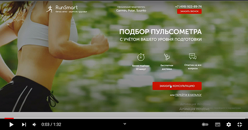
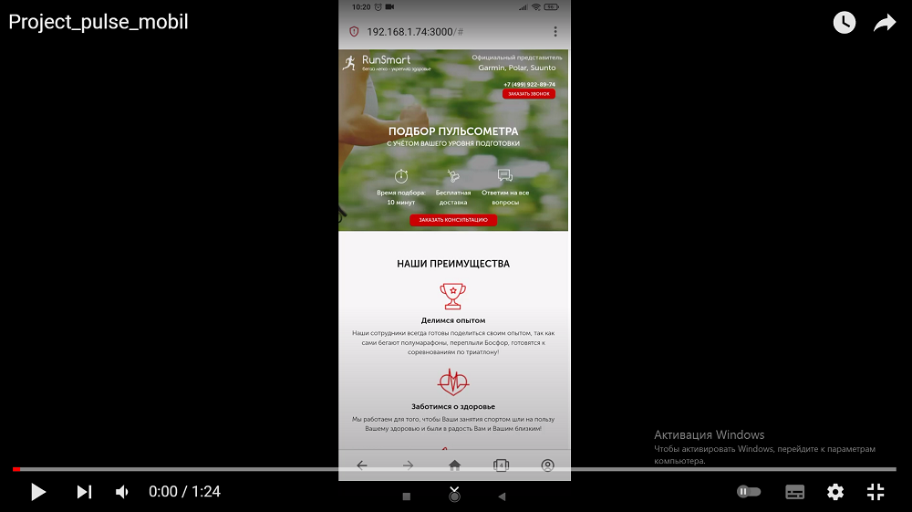

### О чем проект

Верстка сайта продаж пульсометров 

При верстке сайта использовалось:

- колоночная верстка bootstrap-grid  
- препроцессорр SСSS (миксины, переменные, псевдоэлементы)
- планировщик заданий Gulp
- адаптация верстки по различные размеры экранов, используя медиа-запросы (@media)
- написание кода на чистом JavaScript для интерактивной части 

### Демонстрация

#### Версия для ПК

#### Мобильная версия

