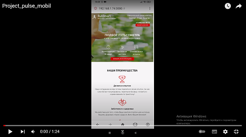

Ссылка на сайт: http://pulse.ykoshelev.ru/

### О чем проект

Верстка сайта продаж пульсометров 

При верстке сайта использовалось:

- колоночная верстка bootstrap-grid  
- препроцессорр SСSS (миксины, переменные, псевдоэлементы)
- методология БЭМ
- анимация 
- планировщик заданий Gulp
- адаптация верстки по различные размеры экранов, используя медиа-запросы (@media)
- написание кода на чистом JavaScript для интерактивной части 

Link to the website: http://pulse.ykoshelev.ru/

### What is the project about

Layout of the website sale of heart rate monitors

When making up the site , it was used:

- column layout of bootstrap-grid
- SASS preprocessor (mixins, variables, pseudo-elements)
- BEM methodology
- animation
- Gulp Task Scheduler
- adaptation of the layout for different screen sizes using media queries (@media)
- writing code in pure JavaScript for the interactive part

### Демонстрация / Demonstration

#### Версия для ПК / PC version

#### Мобильная версия / Mobile version

